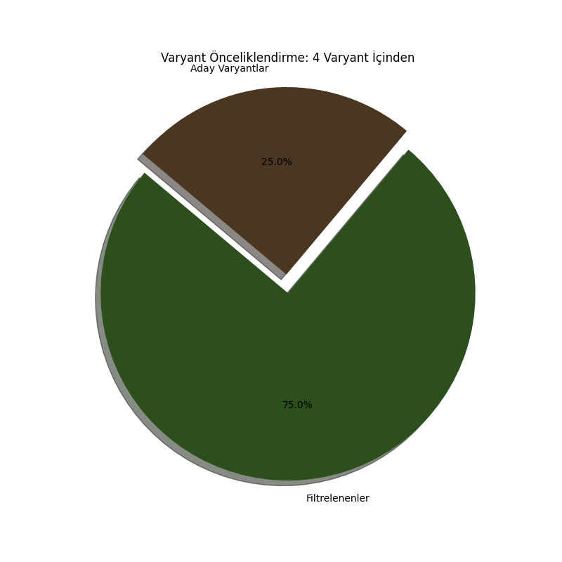

# 🧬 Bio-Variant Sieve: Automated NGS Prioritization Tool

[](https://www.python.org/)
[](https://en.wikipedia.org/wiki/Bioinformatics)
[](LICENSE)

**Bio-Variant Sieve**, büyük ölçekli NGS (Next-Generation Sequencing) verilerinden nadir ve potansiyel patojenik varyantları hızlıca ayıklamak için geliştirilmiş bir komut satırı aracıdır. Özellikle nadir hastalık araştırmalarında "aday gen" belirleme sürecini otomatize eder.

## 🛠️ Temel Özellikler
* **Frekans Filtrelemesi:** gnomAD veritabanı üzerinden populasyon frekansı (AF) bazlı süzme.
* **Kalıtım Modeli Analizi:** Otozomal resesif modeller için homozigot varyant izolasyonu.
* **Fonksiyonel Etki Önceliklendirme:** `stop_gained`, `frameshift` ve `missense` varyantlarını otomatik yakalama.
* **Görsel Raporlama:** Analiz sonuçlarını anlık olarak profesyonel grafiklere (Matplotlib) dönüştürme.

## 📊 Örnek Analiz Çıktısı
Aşağıdaki grafik, ham verinin bu araçla süzülmüş halini ve elenen varyant oranını göstermektedir:



## 🚀 Kurulum ve Kullanım

### Kurulum
```bash
# Depoyu klonlayın
git clone [https://github.com/pinarztrk42/variant_sieve.py.git](https://github.com/pinarztrk42/variant_sieve.py.git)
cd variant_sieve.py

# Gerekli kütüphaneleri yükleyin
pip install -r requirements.txt

#Örnek Kullanım
python variant_sieve.py --input test_data.csv --freq 0.001 --homozigot


## 📝 İletişim & Katkı
Bu proje **Pınar Öztürk** tarafından akademik çalışmalar kapsamında geliştirilmiştir. 
Sorularınız veya iş birliği talepleriniz için [GitHub Profilim](https://github.com/pinarztrk42) üzerinden iletişime geçebilirsiniz.


